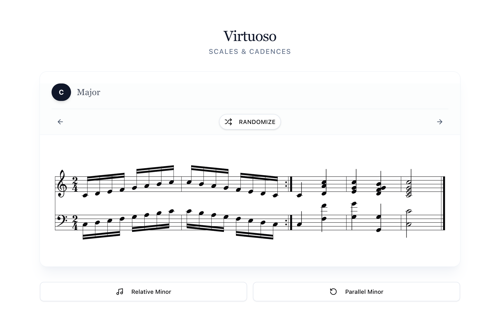

# Virtuoso 🎹

A refined, mobile-first piano practice assistant for mastering scales, cadences, and key signatures. Built with modern web tech for a clean, elegant practice experience.



## ✨ Features

- **Smart Scale Generation**: Major, Harmonic Minor, Melodic Minor with intelligent accidental handling
- **Classical Cadences**: Auto-generated I-IV-I6/4-V7-I voicings with smooth voice leading
- **Circle of Fifths Navigation**: Traverse keys logically with classical theory preference
- **Metronome**: Tempo control with visual feedback
- **Mobile-First**: Optimized for touch, responsive sheet music rendering
- **PWA Support**: Works offline with service worker, installable to home screen

## 🛠️ Tech Stack

- **Framework**: TanStack Start with React 19
- **Styling**: Tailwind CSS 4 + shadcn/ui
- **Sheet Music**: abcjs for dynamic SVG rendering
- **Deployment**: Cloudflare Pages (via Github integration)

## 🚀 Getting Started

### Prerequisites

- Node.js (v18+)
- pnpm

### Installation

1.  Clone the repository:

    ```bash
    git clone https://github.com/secret104278/virtuoso.git
    cd virtuoso
    ```

2.  Install dependencies:

    ```bash
    pnpm install
    ```

3.  Start the development server:

    ```bash
    pnpm dev
    ```

4.  Open your browser at `http://localhost:3000`.

## 🎼 Music Theory Implementation

The core logic resides in `src/lib/music-theory.ts`. It includes:

- **`CIRCLE_OF_FIFTHS`**: A definitive array defining the user-preferred cycle order.
- **`generateGrandStaffABC`**: Converts theoretical scale/chord data into ABC notation strings for rendering.
- **`getNoteFromSemitone`**: Smart enharmonic spelling based on context (flat vs. sharp preference).
